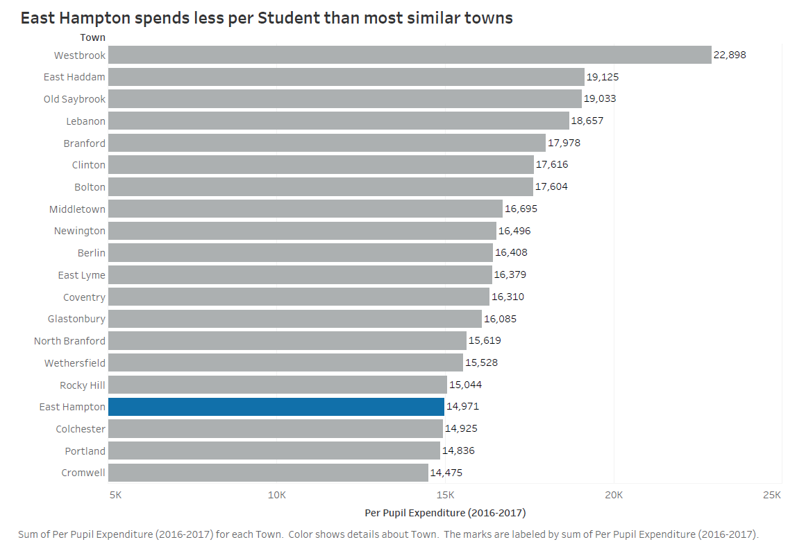

# School Spending
[Return to my portfolio](https://demitrakourtzidis.github.io/portfolio/)

Source: http://ehhs.org/documents/apptegy/district/2017-2018/2018-19%20Budget/Budget-Notes-18-19.pdf

I decided to redesign this chart because this is my hometown, and the school budget is an issue every year. It's decided by a referendum, so it gets very heated and political. Even after I graduated high school, I had to go back and hold up a "Vote Yes" sign on a busy street because the volleyball team was on the chopping block. If it wasn't so terrible, it would be funny. 

I thought the bar chart was the most reasonable option for visualizing these data, so the wireframing process wasn't complicated. I didn't have to change the fundamental parts of the chart. Instead, I focused on refining the message and bringing attention to the most important points. I changed the title to make it easier for viewers to understand the message of the data. The original title was vague, so viewers had to draw their own conclusions. A pointed title draws people in. The original chart also had an unnecessary amount of colors. There was no rainbow effect, but every bar was different. It was a little chaotic. I made every town but East Hampton gray to subdue their respective bars and made East Hampton blue because it is the district's color. The feedback I got didn't change my visualization because it was so simple in the first place. I definitely intend to do a more complicated redesign in the future. 

My redesigned visualization shows per student spending by towns in Connecticut, with one town highlighted. The selected towns are similar, both socioeconomically and demographically. This makes the argument more compelling because the towns are comparable. Comparing East Hampton to a rich town, like Avon or Greenwich, would've made it easy for people to discount the original chart designer's point. I made East Hampton the only colored bar to make it stand out. I wanted the viewers' eyes to go to East Hampton immediately. I wanted the first thing that came across to be how low-ranking the town's spending is. For the same reason, I made the bar chart vertical. I wanted East Hampton to be physically lower than the higher-spending towns. That position has a negative connotation. When a person says something is beneath them, it means that thing is bad. The horizontal orientation didn't utilize space to convey meaning.
